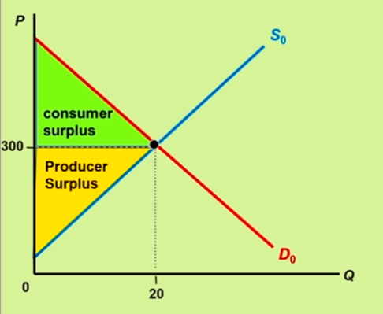

# Introduction

**Economics** is the study of how individuals, firms, and society make decisions to allocate limited resources among many competing wants. Economics assumes that people:

 - are rational
 - are self-interested
 - respond to incentives

 > **Microeconomics**   The study of decision-making by individuals, buisnesses, and industries

 > **Macroeconomics**   The study of broader issues in the economy such as inflation, unemployment, and national output.

**Models** are a simplification of the real world, used in economic analysis to make inferences and suggest plans of action. 

*Ceterius Paribus* is an assumption used in economics that all other relevant factors or variables are **held constant**. 

### Effivency vs. Equity
Efficency is how well resources are used and allocated, whereas equity is the fairness of various issues and policies. 

 
 

# Chapter 1

> **Positive Analysis**   The use of statements or questions that are based on the understanding of information or facts. For example, *"the sky is blue"*.

> **Normative Analysis**   The use of statements or questions that are based on opinions or societal beliefs on what should or should not take place. For example, *"Minimum wage should be raised"*.

## Eight Key Principles

 - Economics is concerned with making choice using limited resources.
   - **Scarcity** - Unlimited wants clash with limited resources. Economics focuses on the allocation of scarece, limited resources to satisfy unlimited wants as fully as possible.

 - When making decisions, one must take into account tradeoffs and opportunity costs
   - **Opportunity Cost** - The value of the next best alternative use of resources. It is what one gives up when choosing an activity or making a purchace. 
 - Specialization leads to gains for all involved
 - People respond to incentives, both good and bad
 - Rational behavior requires thinking on the margin
 - Markets are generally efficient. When they aren't the government can sometimes correct the failure. 
   - **Messy Outcomes** - Markets sometimes result in undesirable outcomes, such as pollution. 
 - Economic growth, low unemployment, and low inflation are economic goals that do not always coincide. 
 - Institutions and human creativity help explain the wealth of nations.

 
 

# Chapter 2

#### Basic economic questions every society must answer

1. What goods and services will be produced?
2. How will these goods and services be produced?
3. Who will recieve the goods and services produced?

### Factors of Production
 - Land
 - Labor
 - Capital
 - Entreprenurial Ability

**Production** - The process of converting factors of production into outputs.

> **Production Efficiency**   Goods and services are produced at their lowest resource/opportunity cost

> **Allocative Efficiency**   The mix of goods and services produced is just what society desires

> **Pareto Efficiency**   A situation where no action or allocation is available that makes one individual better off without making another worse off, basically perfect

### The Production Possibilities Frontier

**Production Possibilities Frontier (PPF)** - A model that shows the combinations of ONLY TWO goods a society can produce at full employment. The PPF shows the combination of two goods that can be produced. Points to the left of the PPF are attainable but inefficient. Points to the right are unattainable. 

**Opportunity Cost** - The cost of a good in terms of another that must be forgone. In the example of the PPF, the opportunity cost is the SLOPE of the PPF.

**Increasing Opportunity Cost** - In most cases, land, labor, and capital can cannot be easily shifted from producing one good to another. 

#### The PPF allows us to answer...

 - What quantities can be produced with the available resources?
 - What is the opportunity cost to change the production mix?

The PPF shifts to the right (outward) as an economy grows due to expanding resources and improving technologies. **An outward shift of the PPF means economic growth.**

Recession is a product of unemployment. Therefore, if there was a recession, the ouput would be at a point below an unchanging PPF. 

### Specialization, Comparative Advantage, and Trade

Specialization and trade increase production. They occur between people and between nations. 

> **Absolute Advantage**   A country can produce more of a good than another country using the same ammount of resources. It is simply "who can produce the most"?

> **Comparative Advantage**   A country has a lower opportunity cost of producing a good than another country. Just because a country has an absolute atvantage, it does not mean they have a comparative advantage. It is not a matter of who can produce more, but who can produce better. 

**The above assumes the following**: All countries can gain from trade if they follow their comparative advantage. 

### Calculating Absolute and Comparative Advantage

<blockquote> <strong>IMPORTANT</strong>: 
<ul>
<li>Even though one country can produce more of both goods, it can still benefit from trade.</li>
<li>Focus on OPPORTUNITY COSTS.</li>
<li>Which country has a lower upportunity cost ofproducing coffee or cocoa?</li>
<li>Comparative advantage is always who <strong>gives up the least</strong>. </li>
</ul>
</blockquote>

 

The dominican republic has an **absolute advantage**. 
The dominican republic has a **comparative advantage** in **cocoa production**. 

---

> To decide who should produce what, compare who has the lowest **opportunity cost** of producing one unit of goods in each nation. 

**Dominican Republic** - Maximum coffee is $100$ and maximum cocoa is $50$. Therefore, the **opportunity cost** for **one ton of coffee** is $\frac{50}{100}$, which is **$0.5$**.

**Haiti** - Maximum coffee is $50$ and maximum cocoa is $40$. Therefore, the **opportunity cost** for **one ton of coffee** is $\frac{40}{50}$, which is **$0.8$**.

The Dominican Republic gives up the **least**. Therefore, they should specialize in **coffee**. 

---

If you have done the first calculation right, the the opportunity cost is the reciprocal of the first calculation is the second calculation. 

**Dominican Republic** - Maximum coffee is $100$ and maximum cocoa is $50$. Therefore, the **opportunity cost** for **one ton of coffee** is $\frac{100}{50}$, which is **$2$**.

**Haiti** - Maximum coffee is $50$ and maximum cocoa is $40$. Therefore, the **opportunity cost** for **one ton of coffee** is $\frac{50}{40}$, which is **$1.25$**.

The Haiti gives up the **least**. Therefore, they should specialize in **cocoa**. 

---

Note that specialization means the will ONLY produce ONE of the two goods. 

 

## Practical Constraints on Trade

 - Costs of trade, including transportation, communications, and general costs of business
 - Diminishing returns to specialization
 - Governments limiting trade to help certain industries or in response to a recession

**Autarky** - Economic independence or self-sufficiency

# Chapter 3

**Market** - An institution that brings buyers and sellers together so that they can interact and transact with each other.

**Price System** - A name given to the market economy because prices provide considerable information to both buyers and sellers.

 - **Buyers**
   - What to buy?
   - How much?
 - **Sellers**
   - What to sell?
   - How much?
   - What method?

**Price System** - Market economices use prices to allocate resources, goods, and services.

---

## Demand

**Demand** - The maximum ammount of a product that buyers are willing and able to purchase over some time period at various prices, *ceteris paribus* (all things constant).

| Price | Quantity |
|-------|----------|
| 100   | 0        |
| 80    | 5        |
| 60    | 10       |
| 40    | 15       |
| 20    | 20       |

### Law of Demand

As price increases, quantity demanded decreases. As price decreases, quantity demanded increases. This assumes that all other relevant factors are held constant. 

Consumers are more willing and able to buy goods and services when prices decrease. 

**Market Demand Curve** - A horizontal summation of all individual demand curves

**Horizontal Summation** - Adding the number of units of the product that will be purchased at each price by all consumers

| Price | Ahmad | Binah | Market |
|-------|-------|-------|--------|
| 12    | 0     | 0     | 0      |
| 10    | 10    | 0     | 10     |
| 8     | 15    | 5     | 20     |
| 6     | 20    | 10    | 30     |
| 4     | 25    | 15    | 40     |
| 2     | 30    | 20    | 50     |

### Determinants of Demand

**Nonprice factors** shift the demand curve. These factors include: 
 - **I**ncome
   - i.e. if you make more income, you will eat out more
   - i.e. if you make less income, you will eat cheap food
 - **R**elated good prices, such as substitutes and complements
   - i.e. the price increase of Good A increases demand for Good B, a substitute, because Good B provides a similar product for a lower price
   - i.e. as the price of salad increases, the demand for salad dressing decreases because salad dressing is a complementary item
 - **E**xpectations about future prices, incomes, and product availablilty
   - i.e. a change in consumers' expectations about future prices, a good's availability, or their own income
   - i.e. when a hurricane comes, more people buy water and gas
 - **N**umber of buyers
   - i.e. as more consumers enter a market, demand increases
 - **T**astes and preferences
   - i.e. it becomes popular for people to wear green tee-shirts

If the price goes up or down, the demand curve **does not** shift. It is simply a **movement along the curve**. For example, if the price of games increases or decreases, it would simply be a movement along an existing demand curve. 

Demand for products that re-popular will increase. 

**Normal Goods** - Demands increases as incomes increase
**Inferior Goods** - Demand decreases as incomes increase

**Price of Complements** - Complements are typically consumed together. If the price of a good increases, one buys less of that good and the demand for its complement decreases

### Change in Demand

A change in demand occurs when one or more of the determinants of demand changes; it shifts the entire demand curve. 

> **IMPORTANT**: A change in demand is not the same as a change in quantity demanded.

A change in demand is when the curve actually shifts, influenced by (IRENT).

A change in the quantity demanded is usually when there is a change in the price. The price **will not** make the demand curve shift.

**Practice Question** - Suppose the popularity of Costa Rica as a travel destination increases. What happens ot the prices and quantities of their tourism facilities. 

The price will increase and the quantity demanded will increase.

## Supply

**Supply** - The maximum amount of a product that sellers are willing and able to offer for sale over some time period at various prices, *ceteris paribus*. 

**Supply Curve**
|Price|Quantity|
|-|-|
20|10
40|20
60|30
80|40
100|50

### Law of Supply
Price and quantity supplied are positively related. As prices rise, providers want to sell more to maximize profit.

**Market Supply Curve** - Horizontal summation of all individual supply curves. 

### Determinants of Supply

**Nonprice factors** shift the supply curve. These factors include
 - Production technology
   - supply increases when improvements in technology lower the cost of production
 - Cost of resources
   - supply increases if the cost of resources (such as labor wages or raw materials) used decreases, and vice versa
 - Prices of related commodities
   - i.e. an increase in prices of electric cars will decrease the supply of gas cars
 - Expectations
   - expecation of a future increase inc price decreases supply now
   - i.e. if the value of commercial real estate is expected increase, owners hold on to their properties, decreasing supply
 - Number of sellers
   - as more producers enter a market, supply increases (and vice versa)
   - i.e. as more firms produce surfboards, supply increases
 - Taxes and subsidies
   - taxes and subsidies affect costs and therefore supply
   - i.e. a 10% tax on imported european cars reduces the supply of such cars
   - i.e. when subsidies on solar and wind energy expire, supply decreases

Change in supply (ITEND) changes supply curve. Change in quantitu supplied changes movement along the supply curve.

## Market Equilibrium

Market equilibrium occurs when quantity supplied equals quantity demanded (Qs = Qd)

**Equilibrium Price** - The price at which Qs = Qd

**Equilibrium Quantity** - The output at which Qs = Qd

### When prices are too high

If P=5, Qd = 10 and Qs = 20, a surplus of 10 units results. Sellers must reduce the price until Qd = Qs = 15. Equilibrium price = $4. 

### When prices are too low

If P=3, Qd = 20 and Qs = 10, a shortage of 10 units results. Sellers must increase the price until Qd = Qs = 15. Equilibrium price = $4. 

### Calculating Surpluses and Shortages

If the quantity demanded is greater than quantity supplied, it is a shortage.
If the quantity demanded is less than quantity supplied, it is a surplus.
To calculate by how much, simply subtract the larger number from the smaller number.

> **Demand vs. Quantity Demanded**   Demand is just how many of an item a consumer is willing to buy—the sheer quantity. Quantity demanded is how many things a consumer will purchase at a specific price.

> **Supply vs. Quantity Supplied**   Supply is the entire supply curve, while quantity supplied is the exact figure supplied at a certain price.

## Demand Shifts and Market Equilibrium

- An **increase in supply** causes the equilibrium to move to a lower price and higher quantity.

 - A **decrease in supply** causes the equilibrium to move to a higher price and lower quantity.

 - A **decrease in demand** causes the quilibrium to move to a lower price and higher quantity.

 - An **increase in demand** causes the equilibrium to move to a higher price and higher quantity. 

If demand and supply both increase, the equilibrium quantity increases, but the equilibrium price depends on the relative magnitude of the shifts. 

### A review of shifts

|Curve|Demand|Supply|Equilibruium Price|Equilibrium Quantity
|-|-|-|-|-
|*One shifts*|No change|Increase|Decrease|Increase|
|*One shifts*|No change|Decrease|Increase|Decrease|
|*One shifts*|Increase|No change|Increase|Increase|
|*One shifts*|Decrease|No change|Decrease|Decrease|
|*Both shift*|Increase|Increase|Indeterminate|Increase|
|*Both shift*|Decrease|Decrease|Indeterminate|Decrease|
|*Both shift*|Increase|Decrease|Increase|Indeterminate|
|*Both shift*|Decrease|Increase|Decrease|Indeterminate|

  

# Chapter 4

> **Consumer Surplus**   The difference between what consumers are willing to and able to pay and the market price

> **Producer Surplus**   The difference between market price and the price at which firms are willing to supply it

 

 

 > **Market Efficiency**   Markets are efficient when they generate the largest possible amount of net benefits to all parties involved

 > **Total Surplus**   The sum of consumer surplus and producer surplus that is maximized when markets are efficient.   $TS = CS + PS$

 

 

 > **Deadweight Loss**   The reduction in total surplus that results from the inefficency of a market that is not in equilibrium. 

 > **IMPORTANT**   Any time there is a deadweight loss, the market is **not** efficient.

## Price Controls

> **Laissez-Faire**   A market that is allowed to function without any government intervention

However, a society sometimes argues that market prices are too high (which harms consumers) or too low (which harms producers). Government sometimes establishes a **price ceiling** or a **price floor** in a market.

 > **Price Ceiling**   The maximum price of a good or service established by government

 

 > **Price Floor**   The minimum price of a good or service established by government

Note, the images are BINDING. 

Markets are usually, but not always efficient. Sources of market failure occurr because of:
 - **Lack of competition**
   - When a market lacks competition, a firm can raise prices without worrying that other firms will undercut its price
 - **Asymmetric information**
   - Occurs when one party to a transaction has better information than another party, such as when purchasing a used car or an expensive art piece
 - **External cost**
   - Occurs when an action adds a cost to a third party(such as driving, which creates pollution and traffic congestion)
 - **Public goods**
   - Non-Exclusive
     - Once a public good is provided, no one can be excluded from using it
   - Nonrival
     - One person's consuption does not diminish benefits to others

**Examples of Market Failure**
 - Climate Change
   - This is a market failure because it exhibits characteristics of public goods. Actions taken to combat climate change are costly, but the benefits are enjoyed by everyone
 - Health Care
   - A service that is difficult to provide to everyone, especially when some people choose not to buy health insurance
 - Education
   - Offers external benefits by making society more productive, but increasing educational opportunities requires subsidies that are funded by tax venues

 

> **Private Good**   A private good is a product that must be purchased to be consumed, and consumption by one individual prevents another individual from consuming it.

