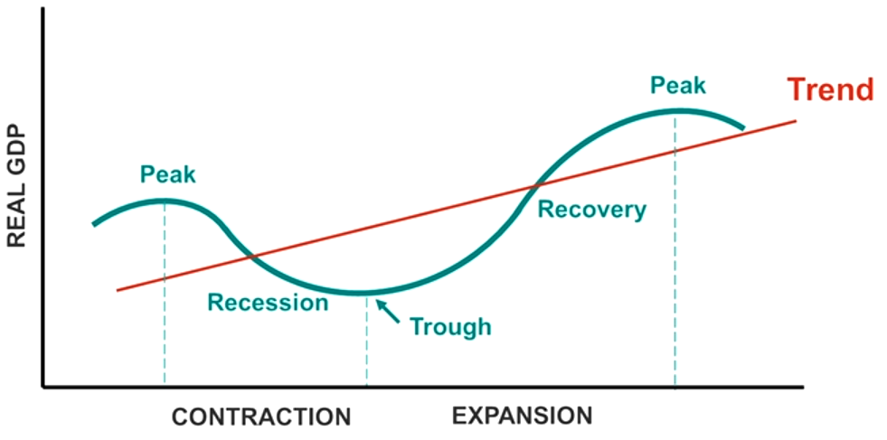
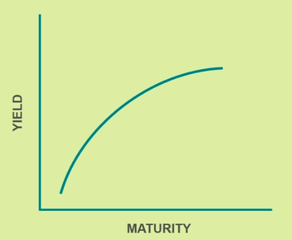
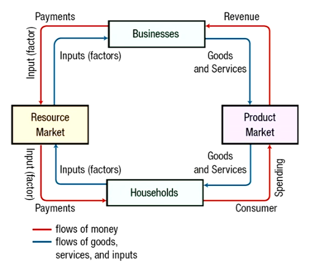
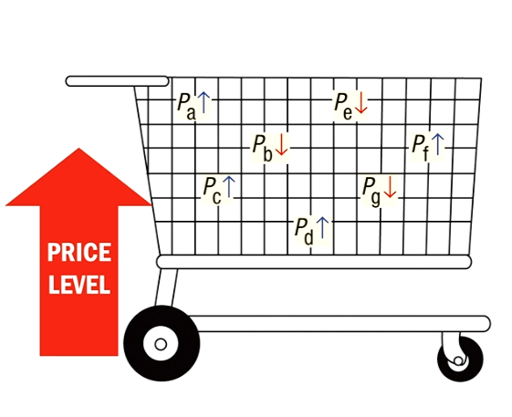
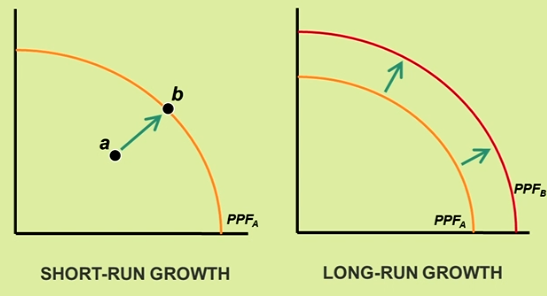
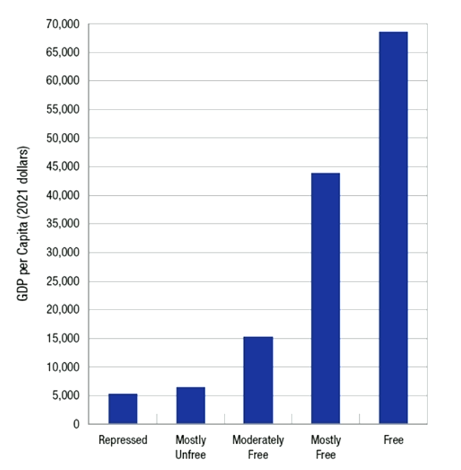

# Chapter 5

> **Business Cycles**   The alternating increases and decreases in economic activity

 - They vary in intensity and duration.
 - Generally, they show a long-term upward trend
 - The four phases include **peak**, **recession**, **trough**, and **recovery**. 

 

 Points that go to the right of the peak begin the recession, which does not have to be instant or severe but can also be very subtle. A recession often means the start of a downward trend. It could be a product of Unemployment or reduced productivity. When it is in a trough, it will end when the economy reaches a relative peak. A recovery can be worse than a recession since you have to start from a lower amount. We do not want peaks to be extremely high, as this would entail the lowest of lows. Steady growth is better than erratic growth. 

 The NBER (National Bureau of Economic Research) officially dates the U.S. business cycle. It looks for **turning points**, at which the economy switches from peak to downturn or from trough to recovery. Turning points are established by a consensus of eminent economists after private deliberations.

 A recession is typically declared after **two consecutive quarters of negative GDP growth**. One is not enough because the economy naturally flows. For example, Q4 is economically prosperous, but Q1 is usually less prosperous than Q4. A **double-dip recession** occurs when a recovering economy does not reach its former peak. 

> **National Activity Index**   A weighted average of 85 indicators of economic activity. A recession is likely if the index falls below -0.70. 

> **Leading Economic Index**   Measures 10 important leading indicators. A recession is likely if the index decreases three months in a row.

> **Yield Curve**   Shows the interest rates for bonds (vertical axis) with different maturity rates (horizontal axis).

Note that the inverse yield curve would indicate a recession (an upside-down yield curve). You can either have one regular, upside-down, or straight. 

## National Income Accounting

The National Income and Product Accounts (NIPA)

- Measures the nation's economic performance
- Compares U.S. income and output to those of other nations
- Tracks the level of economic activity throughout the business cycle

The size of an economy can be measured in two basic ways: 
- Adding up all spending
- Adding up all income earned

The spending approach is more common than the income-earned approach. 

The **product market** is a marketplace where final goods or services are sold to households and the foreign sector, but the **resource market** is a market where a business can go and purchase resources to produce goods and services.

Gross domestic product is the most common measure of an economy's size. 

> **Gross Domestic Product (GDP)**   The total market value of all **final goods and services** produced by resources in a country in a given year. This means ONLY end consumer goods. 

For a good or service to be included in a given year's gross domestic product (GDP), they must: 

- **Have a market value**: The good or service must be sold in a market transaction.
- **Be a final good or service**: It must be intended for the end user and not used as an input in the production of other goods and services.
- **Be produced within a given country**: The production must occur within the borders of the country whose GDP is being measured.
- **Be produced within a certain time frame**: It must be produced during the time period for which GDP is being calculated, typically within a year.

 

> **Gross National Product (GNP)**   The market value of all goods and services produced domestically and abroad using resources supplied by a country's citizens. For example, a German company that opens a car factory in the U.S. would count as US GDP. It would be all economic activity in the United States. 

For example, 
- Brooks running shoes made in China count toward US GNP but not US GDP.
- A Toyota Camry assembled in the United States counts toward US GDP but not US GNP.

## Two Ways of Measuring GDP

### Expenditures Approach

Measures total spending, including consumption, investment, government spending, and net exports.

$Y = C + I + G + (X - M)$

> **C = Personal consumption expenditures**   Includes purchases of durable goods, nondurable goods, and services by consumers and businesses. This is the largest component. 

> **I = Gross private domestic investment (GPDI)**   Includes investment in structures (residential and business), equipment and software purchases, and changes in business inventory. A house built in 1970 will NOT be included in the 2024 GDP. 

> **G = Government spending**   Includes wages (federal, state, and local), purchases of goods and services from private businesses, and purchases of new structures and equipment.

> **X - M = Net Exports**   In most years, U.S. imports exceeded exports. Net exports are a negative percentage of GDP. X (Exports), M (Imports). We import a lot, but we do not export a lot, so this is usually negative, but in China, it would be the opposite. 

---

### Income Approach

Measures the total payments to the various factors of production.

GDP can also be calculated as the payment to factors of production. For example,
- Compensation of employees: Payments to an individual for work performed for a company
- Proprietors' income: Income of tax-exempt or owner-run businesses
- Corporate profits: Income that flows to corporations
- Rental income: Income that flows to individuals who rent real property but does not include the income of real estate agents or brokers
- Net Interest: Interest paid by businesses less than the interest they receive. Payment for the use of capital and land. 
- Taxes on production and imports: Business taxes
- Adjustments to national income: 

A higher GDP generally means a higher average standard of living. Real GDP takes prices into account. 

> **Purchasing Power Parity (PPP)**   GDP-PPP takes into account differences in the cost of living between countries (especially services) to adjust GDP measures

> **Population**   GDP per capita takes into account differences in the sizes of countries by dividing GDP by population 

For example, if the GDP was 100 and the population count was 10, the GDP per capita would be 100/10, or 10.  

Note that GDP per capita does **not** provide an accurate representation of...
- How people distribute their time between work and leisure.
- Production that occurs outside of the market economy
- Changes in environmental equality

India has a very large GDP, but most of its citizens are poor. Lichenstein has a very small GDP, but most of its citizens are wealthy. 

> **Important**   GDP does not take into account environmental quality (happiness, environmental quality). 

The informal economy varies from country to country (about 10% of the U.S. economy) and involves informal or nonmarket activities. 

---

**Question**: North Face is a popular U.S. brand. However, most of its apparel is produced in China. In which category would the value of North Face apparel sales appear?  
**Answer**: U.S. GNP

**Question**: Which variables constitute the largest portion of GDP using the expenditures and income approaches, respectively?
**Answer**: Consumption; Compensation of Employees

  

# Chapter 6

> **Inflation**   A general rise in prices of goods and services

Although prices have risen significantly over time, wages rose even faster for most workers. Prices increase faster than wages do. 

### What causes Inflation?

Inflation measures increases in the cost of living due to:

1. **Demand Factors**, such as consumer confidence, income, and wealth
2. **Supply Shocks**, like increases in the price of inputs such as oil, resources, and farm crops
3. **Government Policy**, such as borrowing and printing money

Inflation is measured against a market basket. Some prices rise and some fall, but overall, the price level increases. It is the average general price increase. 

> **Price Level**   The hypothetical measure of overall prices for some set of goods and services in an economy or monetary union during a given interval, normalized relative to some base set. Typically, the general price level is approximated with a daily price index, normally the Daily CPI.

### Measuring Inflation

Each month, The Bureau of Labor Statistics (BLS) issues the following measures of Inflation:
1. **Consumer Price Index (CPI)**, which measures retail prices of consumer goods and services
2. **Producer Price Index (PPI)**, which measures wholesale prices
3. **GDP Deflator** measures the average price of all goods and services in the economy

## Consumer Price Index (CPI)
The CPI is used to measure the average change in prices paid by urban consumers (CPI-U) and urban wage earners (CPI-W) for a market basket of consumer goods and services. CPI is a **Cost-of-Goods Index**, which means it compares the cost of a fixed bundle of goods and services from one period to the next. This is essentially the "cost of living." 

Calculating the CPI can be done by first defining a base year and then finding the cost of the market basket for that year. Find the current cost and use the following formula to compare costs: 

$$CPI = \frac{cost\:in\:base\:period}{cost\:in\:current\:period} \times 100$$

$$\%\:change\:in\:price = (\frac{CPI\:in\:current\:year}{CPI\:in\:original\:year} \times 100) - 100$$

### Example Problem

The average American eats four hot dogs and two hamburgers (Market Baskets)

Year|Hotdogs|Hamburgers|Market Basket|CPI
-|-|-|-|-
2008|$1|$2|(1 x 4) + (2 x 2) = 8|(8/8)*100 = 100
2009|$2|$3|(2 x 4) + (3 x 2) = 14|(14/8)*100 = 175
2010|$3|$4|(3 x 4) + (4 x 2) = 20|(20/8)*100 = 250

Note: In the base year, the CPI is ALWAYS 100. 

The inflation from 2008 to 2009 is $\frac{175 - 100}{100} \times 100 = 75\%$ 
The inflation from 2009 to 2010 is $\frac{250 - 175}{175} \times 100 = 45\%$

---

Note that the CPI measures only **private goods**. CPI tends to overstate Inflation because it uses a **fixed market basket**. It does not account for **product substitution**, **quality improvements**, or **new products**. Market surveys are three to five years old. 

For example, CPI measures only consumers' out-of-pocket healthcare expenditures. It does not measure the overall increase in healthcare costs. 

### Producer Price Index (PPI)

This measures the average change in the prices received by domestic producers for their products. 

> **GDP vs. GNP**   Nominal GDP for a given year is measured in dollars of that year, whereas real GDP is measured in dollars of some base year.

### Calculating Nominal GDP

$Nominal\;GDP = P \times Q$

#### Example Problems

Year|Price|Quantity|Nominal GDP
-|-|-|-
2020|2|2|4
2021|4|2|8

Year|P of HD|Q of HD|P of HB|Q of H.B. |Formula|Nominal GDP
-|-|-|-|-|-|-
2008|1|100|2|50|$(1 \times 100) + (2 \times 50)$|200
2009|2|150|3|100|$(2 \times 150) + (3 \times 100)$|600
2010|3|200|4|150|$(3 \times 200) + (4 \times 150)$|1200

### Calculating Real GDP

In the base year, the nominal GDP is equal to the real GDP. Note that the price says the same, but the quantity changes. 

Given the base year 2008...

Year|Formula|Real GDP
-|-|-
2008|$(1 \times 100) + (2 \times 50)$|200
2009|$(1 \times 150) + (2 \times 100)$|350
2010|$(1 \times 200) + (2 \times 150)$|500

### Calculating the GDP Deflator

> **GDP Deflator**   An index of the average prices for all goods and services in the economy, including all components of GDP, such as consumption, investment, government spending, and net exports. 

For example, the GDP Deflator in 2009 is $\frac{600}{350} \times 100 = 171$, given the table above.  
The GDP Deflator in 2010 is $\frac{1200}{500} \times 100 = 240$

The formula for calculating the GDP Deflator is...

$$GDP\;Deflator = \frac{Nominal\;GDP}{Real\;GDP} \times 100$$

> **Disinflation**   A reduction in the rate of Inflation. Prices rise at a decreasing rate.

> **Deflation**   A decline in the price level. Average prices decrease. 

### Attitudes Toward Inflation

#### Those who Benefit

- Debtors (borrowers) benefit from unanticipated Inflation because the real value of their fixed payments falls over time. 

#### Those who are Harmed

- People living on fixed incomes see their purchasing power decline. 
- Creditors (lenders) see the real value of their loan repayments fall.

#### Those who are unaffected

- Workers whose wages have escalator clauses. 
- Social security recipients whose benefits are adjusted with Inflation. 
- Banks that properly anticipate Inflation

**Escalator clauses** are designed to adjust payments or wages for changes in the price level. For example,
- Commercial Rental Agreements
- Labor Union Contracts
- Social Security Payments

### Adjusting for Inflation

Price indexes are used to modify payments to account for Inflation. They are used to convert **nominal values** to **real values**. 

> **Nominal Values**   The current monetary value. Presents the current headline monetary figure. Values are calculated without taking Inflation or other factors into account. 

> **Real Values**   Takes into account the effects of Inflation. Provides a guide to actual purchasing power and the opportunity cost of workers. This occurs when values are adjusted for Inflation. 

### Converting Nominal to Real Values
Change nominal values to real values using the following formula: 
$$real\: value = nominal\: value \times (base\: year \div current\: year)$$

For example, let nominal GDP = 600 million and GDP Deflator = 120. 

Given the nominal GDP, what is the Real GDP?

$600,000,000 \times \frac{100}{120} = 500,000,000$

Thus, the Real GDP is 500 million. Note that the base year is always 100. 

You can also convert real values to nominal values using the following:

$$nominal\: value = real\: value \times (current\: year \div base\: year)$$

### Consequences of Hyperinflation

- Hyperinflation is typically caused by **excessive government spending** over tax revenues and the **printing of money** to finance deficits. 
- Workers are paid frequently, and purchases are made immediately.
- Eventually, the monetary system breaks down, and barter is used. Foreign currencies become valuable as a medium of exchange. 

## Unemployment

**Unemployment** is the number of people who are not working but are **able and willing to work** and **actively seeking a job**. 

### Measuring Unemployment

Each month, the BLS reports the
- Size of the labor force
- Number of people employed
- Number of people unemployed

The **unemployment rate** can be calculated as $number\; of\; people\; unemployed \div labor\; force$ 
The **labor force** can be calculated as $number\; of\; people\; employed \div number\; of\; people\; unemployed$ 
The **labor force participation rate** can be calculated as $labor\; force \div adult\; population$

A person is counted as **employed** if any of the following applies
- Works full-time or part-time
- Works at a temporary job
- Has a job but is on vacation, ill, on family leave, on strike, etc.
- Is an unpaid family worker working at least 15 hours per week

> **Unemployed**   An unemployed person does not have a job but has been actively seeking work in the **past four weeks**.

> **Labor Force**   The labor force is the total number of those employed and unemployed. Thus, if you do not have a job but have also not been seeking work in four weeks, you are no longer in the labor force. 

For example, students without a job are neither employed nor unemployed. They are not in the labor force.  
A full-time student who works part-time as a driver (even just a few hours a week) is employed. 

Both surveys are needed for a complete picture of Unemployment:

> **Household Survey**   A survey of about 60,000 households conducted by the Census Bureau

> **Payroll Survey**   A survey of about 142,000 companies and government agencies

Investors and economists are interested in employment trends and the ways they affect the overall health of the economy. For example, the **weekly jobs report**, released by the Department of Labor each Thursday, provides an estimate of the number of persons filing for Unemployment for the first time. 

### Changes in the Labor Force Over Time

The labor force is constantly changing. For example,

- **Population Growth**: The overall increase in the number of available workers
- **Demographic Changes**: Average age of the population, birth rates, and immigration
- **Socioeconomic Reasons**: More women working, delayed retirement
- **Economic Conditions**: More discouraged workers cause workers to go back to school

### Problems With Unemployment Statistics

The official U.S. unemployment rate does not account for
- **Underemployed Workers**: Those working part-time or seeking a better job
- **Marginally Attached Workers**: Those who actively looked for work in the past 12 months but not in the past for weeks.
- **Discouraged Workers**: The portion of marginally attached workers who have given up actively looking for work. 

### Calculating the Labor Force Participation Rate
If the population of a country is 1 million, but the labor force is 600,000, the labor force participation rate is 0.6 percent. If the number of employed individuals is 550,000 and the number of unemployed individuals is 50,000, the unemployment rate is the number of unemployed divided by the labor force, or 50,000/600,000, which is 8.3%. 

Let's say that 10,000 workers become discouraged. The new labor force number would be 590,000. This would not have an effect on the employed population, but the new unemployment population would be 40,000. This means that the new unemployment rate is 40,000/590,000, which is 6.78%.

### Common Causes of Unemployment

- **Job Searching and Matching**: It takes time for employers to find a job and find the right employees.
- **Efficiency Wages**: Wages are kept above equilibrium to reduce turnover and improve productivity.
- **High Minimum Wages**: If wages are too costly, hiring is likely to be reduced
- **Business Cycle**: Recessions reduce consumer demand, leading to layoffs

### Types of Unemployment

- **Frictional Unemployment** results from workers who voluntarily quit to search for a better position.
- **Structural Unemployment** is caused by changes in consumer demand for technology. For example, the demand for travel agents has significantly decreased. Many factory workers have been replaced by robots. 
- **Cyclical Unemployment** is caused by fluctuations in the business cycle, such as recessions. For example, there are many holiday seasonal workers at the mall who are only needed near Christmas. 

### Natural Rate of Unemployment

Frictional and structural employment **always exist**. Cyclical Unemployment is the focus of most public policy. The **natural rate of Unemployment** is equal to the sum of *frictional Unemployment + structural Unemployment*. The natural rate of Unemployment is generally around 4-6 percent, but these are not hard limits. 

> If cyclical Unemployment is at 0 percent, it is the natural rate of Unemployment. 

The natural rate of Unemployment is also referred to as the **nonaccelerating inflation rate of Unemployment**, or (NAIRU). When this occurs, inflationary pressures are at their minimum. Actual Inflation is equal to people's expectations. Price and wage decisions are consistent. Cyclical Unemployment is zero. 

  

# Chapter 7

Economic growth is the primary factor in explaining how well people live and their standard of living. 

**Economic Growth** contributes to the following factors that improve the **standard of living**:
- Reduced poverty rates
- Improved health and longer life expectancies
- Greater investment in education and technology

Economic growth is most commonly measured by **real GDP** and **real GDP per capita**. Real GDP is the goods produced. Nominal GDP also takes into account prices. 

> **Real GDP**   The total output in a year measured in constant-year prices

> **Real GDP per Capita**   Real GDP divided by popluation

## Measuring Real GDP Growth

The Bureau of Economic Analysis (BEA) provides quarterly reports on changes in U.S. GDP. The reports reflect two rates:

> **Annualized Rate**   The quarterly change in GDP multiplied by 4. It highlights seasonal fluctuations in growth.

> **Year-Over-Year Rate**   A comparison of the GDP at the end of a quarter with the same day the previous year. It provides the growth trend for an entire year.

Compounding allows small rates of growth to result in substantial increases in income over time. For example, depositing $1,000 at a 5% annual return results in 5,516 dollars, whereas 10% would return 28,102 in 35 years. 

### The Rule of 70

The rule of 70 can be used to estimate the number of years it takes for a value to double. The formula is:

$$70 \div annual\ growth\ in\ percent$$

For example, at a 10% annual growth rate, it will take seven years for a value to double because $70 \div 10 = 7$.

## Economic Growth

> **Short-Run Growth**   Occurs when an economy makes use of existing but underutilized resources. It is common during recovery from a recession.

> **Long-Run Growth**   Occurs when an economy finds new resources or ways (such as new technology) to better use existing resources. 

Short-run growth is shown as a movement toward the PPF, while long-run growth is shown as an outward shift of the PPF. 

For example, the discovery of large natural gas deposits in the United States can return to long-run growth. Any increase in the four factors of production (Land, Labor, Capital, and Ideas) will boost long-run growth. 

**Four Factors of Production**

**N** - Land and natural resources: Land and raw resources from the land.  
**L** - Labor: Mental and physical talents.  
**H** - Human capital: training and education.  
**K** - Physical capital: manufactured items used to produce goods and services.  
**A** - Entrepreneurship or ideas: the ability to use resources to produce goods and services.  

A **production function** shows how an economy turns inputs into outputs using existing technology. It shows the output that is being produced from different combinations of inputs combined with existing technology. The classical form of the production function determines output as a function of labor and capital. 

$$output = f(L, K)$$

You can also incorporate all of the production factors into the production function.

$$output = A \times f(L, K, H, N)$$

According to the function above, technology (A) enhances the productivity of all physical resources. 

## Achieving Economic Growth

> **Productivity**   This measures how effectively inputs are converted to outputs. Productivity is a key driver of wages and incomes. Increasing productivity can result from several factors. 

> **Labor Productivity**   This is the ratio of the output of goods and services to the labor hours used to produce that output.

Improved land or discoveries of natural resources, such as oil and natural gas, lead to natural growth. Investment in human capital improves the quality of labor, leading to higher growth rates. 

### The Capital-To-Labor Ratio

> **Capital-To-Labor Ratio**   This measures the amount of physical capital available per worker. A higher ratio means greater labor productivity. Capital is subject to **diminishing returns**.

> **Diminishing Returns**   Each additional unit of capital increases output by a positive but smaller amount each time. 

### The Catch-Up Effect

This describes why developing countries may initially grow faster than developed countries. Developing countries can cause existing technologies to make their inputs more productive, while developed countries must innovate to increase growth. The catch-up effect is subject to **diminishing returns to capital**. Improvements in technology and new ideas lead to economic growth. 

### Total Factor Productivity

This measures the portion of output that is not explained by the amount of inputs used. It captures the external effects influencing the productivity of all inputs. This could include factors such as
- Natural Disasters
- New discoveries or innovations
- Changes in a country's institutions

### The Role of Government

The government can influence the economic growth of a country by:
- Contributing to physical capital, human capital, or technology
- Enforcing contracts, protecting property rights, and maintaining a stable financial system
- Promoting free and competitive markets

For example, maintaining a country's infrastructure ensures efficient transport of goods and services. Public colleges and universities are established to enhance human at a lower cost to students. 

### Economic Freedom and Per Capita GDP

Countries with higher economic freedom have a higher average GDP per capita. 

---

**Question**: U.S. GDP is about greater than China's GDP, but the U.S. growth rate and China's are at these rates. Will China's GDP surpass the U.S. GDP within 23 years?  
**Answer**: 70/6 = 11.67, but 70/3 = 23. Thus, China's GDP will double in around 12 years, but it will take the U.S. 23 years to double. 

**Question**: What is the single most important factor influencing economic growth for an economy?  
**Answer**: Increased Productivity

**Question**: Why does protecting intellectual property, such as music and books, from piracy lead to economic growth?  
**Answer**: The monetary incentive of novel innovation is increased by the protection of the unique idea. Without property rights, there is no reason to invent.

