# Chapter 8

### The Classical Model

Pre-1930s mainstream economic thought argued that a Laissez-Faire (Leave it alone) approach was the best for the economy. They noted the economy was self-correcting and always adjusted to full employment by the forces of demand and supply. Prices, wages, and interest rates were flexible. 

### The Great Depression

A prolonged downturn challenged the classical perspective. John Maynard Keynes argued that government has an important role in stabilizing a distressed economy. Keynesians argued that prices and wages were sticky or slow to adjust. Keynes published **The General Theory of Employment, Interest, and Money** in 1936. 

John Maynard Keynes (1883-1946) was known as the father of macroeconomics. He launched a critique of classical economics by focusing on spending as the key to growth. His writings still influence economic policy. His philosophy was that "in the long run, we are all dead."

## Aggregate Expenditures

Aggregate expenditures (AE) consist of the components of GDP that are measured by spending. 

$$ GDP = AE = C + I + G + (X - M) $$

Consumption (C) is the largest component, representing about 68% percent of the GDP. Consumption is the key factor in the AE model. 

Consumption is the portion of income that is not saved. Income is represented by y.

$$y = C + S$$

### Keynesian Consumption Function

Saving is negative to the left of point *a*, and positive to the right of point *a*. At point *a*, I am spending everything I make. As the income increases, the savings increase more. As the income decreases, the savings decrease (debt). 

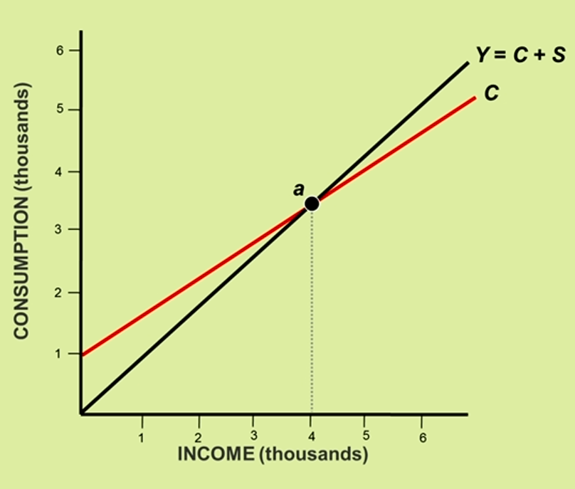

Consumption spending grows as income grows, but not as fast. As income rises, savings rise as a percentage of income. **Classical economists believe that interest rates determine saving**, while **Keynesians believe that income determines saving**. 

### Average Propensity to Consume (APC) and Save (APS)

> **APC**   The percentage of income that is used for consumption, calculated as $C \div Y$. 

> **APS**   The percentage of income that is saved, calculated as $S \div Y$.

Note that because $Y = C + S$, this means that $APC + APS = 1$.

### Marginal Propensity to Consume (MPC) and Save (MPS)

> **MPC**   The change in consumption given a change in income, written as $\Delta C \div \Delta Y$. 

> **MPS**   The change in saving given a change in income, written as $\Delta S \div \Delta Y$. 

Because Y = C + 2, MPC + MPS = 1.

For example, if a person gets a 10,000-dollar raise and they spend 5,000 more dollars, their MPC is 0.5, and their MPS is 0.5. 

### Other Determinants of Consumption

Income is the principal determinant of consumption and saving, but other factors can shift the consumption and saving schedules, such as: 
- Wealth
- Expectations about future prices and income
- Household debt
- Taxes

Investment is spending by businesses that adds to the productive capacity of the economy. 

**Question**: If the marginal propensity to consume is 0.4 and new spending is $100, then total spending will increase by:
**Answer**: The spending multiplier is 1/(1 − MPC) = 1/(1 − 0.6). The total spending would increase by 1.67 × $100 = $167.

### The Instability of Investment
Gross private domestic investment is much more volatile than consumption spending. Consumption does not change very much, but you can't stop spending money on food, housing, and other essentials. 

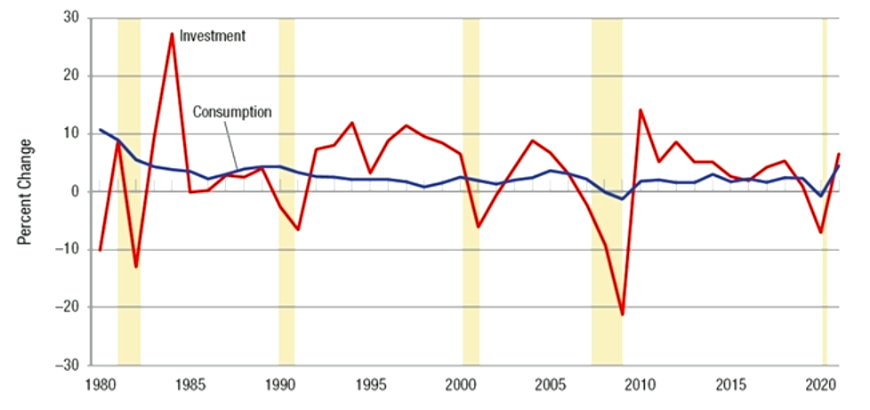

Investment is around 17%, but it is a good indicator of recessions, and it is very important.

## Investment Demand

Investment levels depend primarily on the rate of return on capital. Investments earning a high rate of return are those undertaken first. Interest rates also affect investment because most business investments are financed. As interest rates fall, investment increases. Note that the interest rate is the price of a loan. 

Investment demand also depends on 
- Expectations about future revenues and return on investment
- Technological change
- Operating Costs
- Capital Goods on Hand

### Aggregate Investment Schedule

Investment spending is autonomous (independent) of income. 

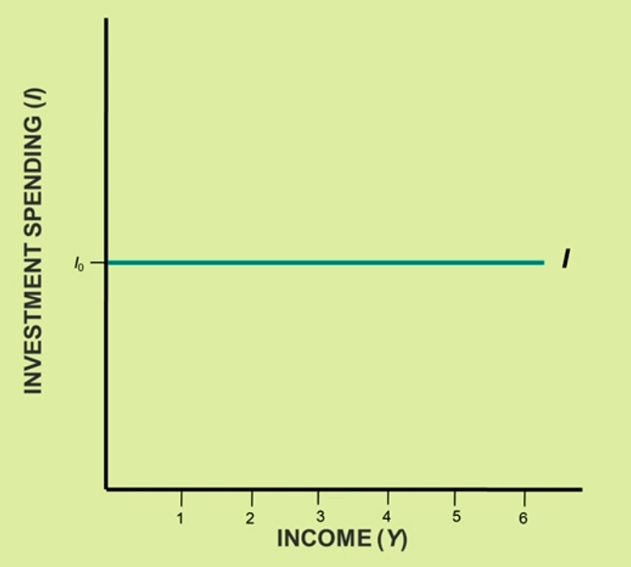

The Simple Aggregate Expenditures Model includes consumption and investment.

$$ AE = C + I$$

Consumption is about 68% of aggregate spending, large and stable. Investment is about 17% of aggregate spending, volatile and sensitive to economic conditions. 

## Simple Aggregate Expenditures Model

Point *a* in both panels represents zero saving (income equals consumption). If *AE* increases by $100, equilibrium income increases by $400, where S = I. If we were at point *a*, the economy would need to grow to sustain investment. If the income was at 5,000, then the economy would need to shrink because there would be an excess of funds. 

The change in investment is 100, the change in Y (income) is 400. Thus, the spending multiplier is 4. 400/100 = 4. From this, the MPC is 0.75. 

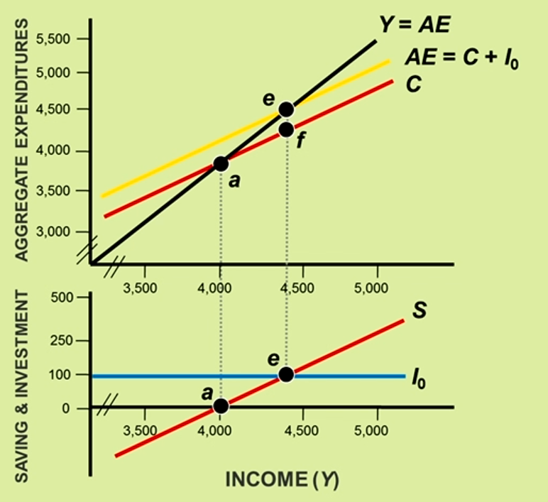

Note that (e-f) = 100. There is no investment if there is no saving. Saving is equal to investment. Thus, savings equals investment. Incomes need to go up in order for savings to go up. When savings go up, investments go up because there is now excess money to invest. 

In order to get a $100 increase to get to the $100 investment, they need a $400 increase in income. 

### Macroeconomic Equilibrium

The economy is at equilibrium where injections of spending (investment) equal withdrawals (saving), where $I = $S. At this point, there is no reason for the economy to change its level of output or income. 

### The Multiplier Effect

This occurs when an initial amount of spending causes income to grow by a larger amount. In other words, spending generates even more spending. The multiplier effect is calculated by

$$ \frac {1}{1- MPC} $$

The greater the MPC, the larger the spending multiplier. 

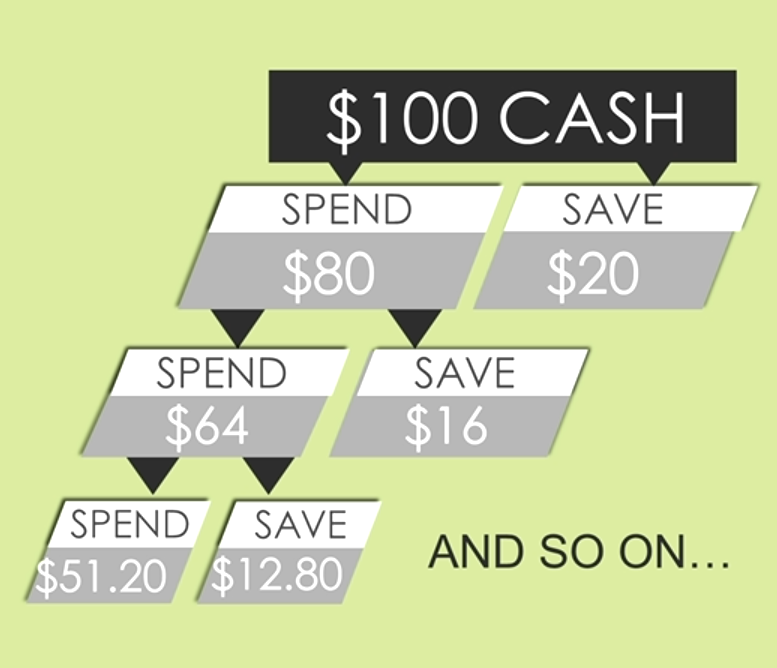

If the MPC is 0.8, the sum is 1/(1-0.8), 1/0.2, meaning that five times 100, the change in consumption would equal 500. 

The total potential effect on income is the initial change in spending times the multiplier. When MPC = 0.8, the potential increase in income from a 100-dollar increase in spending is 100 * 5, which equals 500, this also means saving will also increase by 100. 

The multiplier works in both directions. A decrease in spending during an economic downturn can cause a larger drop in income. If consumers increase their savings during a recession, they may inadvertently make the recession worse. 

## Saving and Investment

An increase in investment of $100 creates more than a $100 increase in income. In this case, the $100 results in income increasing by $400 (point *e* to *b*). 

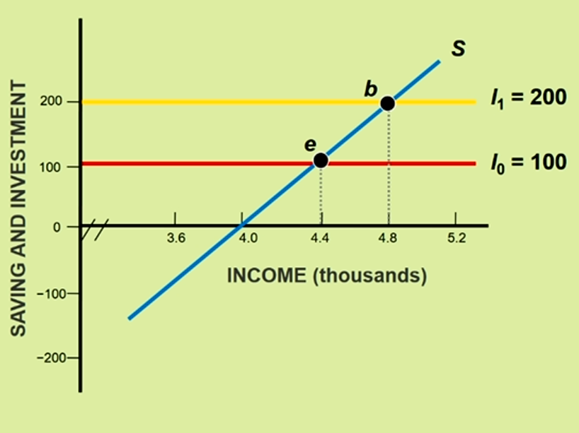

$$ C + I + G + ( N - X ) = 1 / (1 - MPC) $$

### The Paradox of Thrift

If households save more, the multiplier becomes smaller, leading to reduced output and income, which then leads to less saving. 

## Injections and Withdrawals

> **Spending Injections**   Injections include investment (I), government spending (G), and exports (X). 

> **Spending Withdrawals**   Withdrawals include savings (S), taxes (T), and imports (M). 

In macroeconomic equilibrium...

$$I + G + X = S + T + M$$

### Saving, Investment, and Government Spending

An increase of $100 in government spending has the same effect on income as an increase in investment. Both are injections into the economy. 

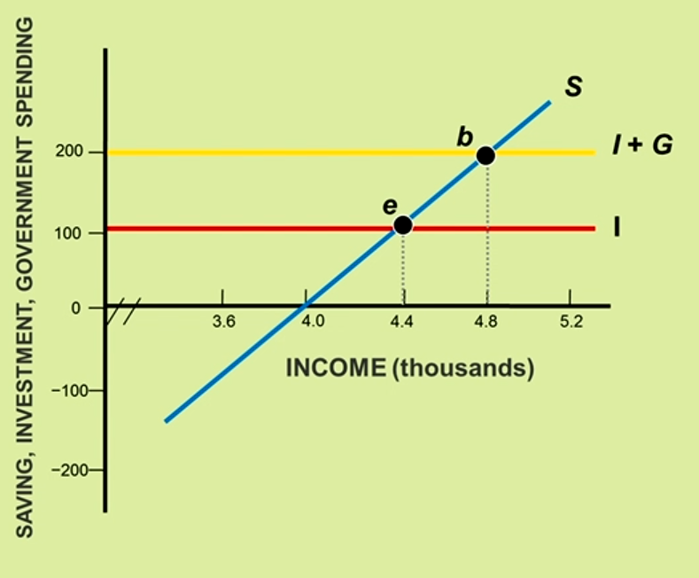

Thus, $ G(multiplier) = \frac{1}{1-MPC} $. 

Taxes have a less direct impact on income than an equivalent change in government spending because some of the tax is paid using savings. 

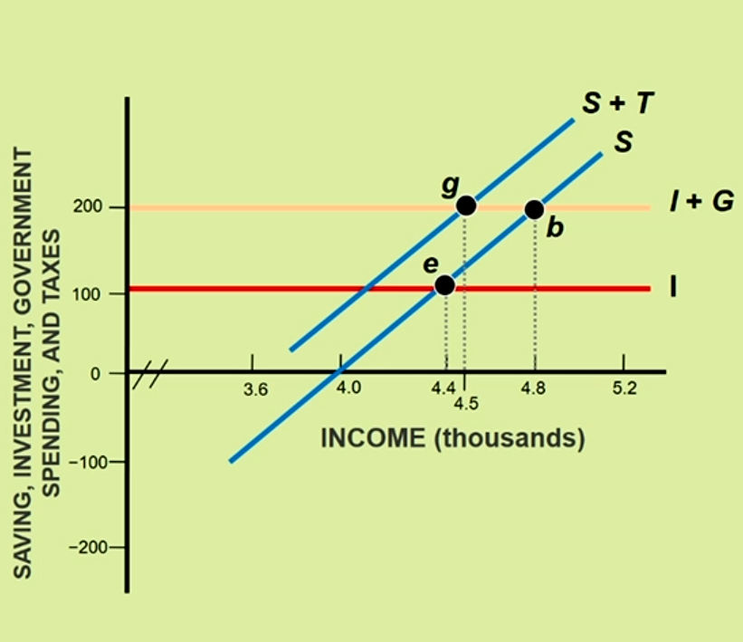

$$ T_{axes} = \frac{-MPC}{1 - MPC} $$

In the graph above, a 100$ increase in taxes caused a decrease in income by about 300$. Thus, the multiplier is -3. Assuming our MPC is 0.75, the equation $\frac{-0.75}{1-0.75}$ which is $\frac{-0.75}{0.25}$ which is -3. From this, the effect of a tax is significantly less than the impact of consumption and investment. 

### Balanced Budget Multiplier

Equal changes in government spending and taxation lead to an equal change in income. If a $1 billion increase in spending is financed by a $1 billion tax increase, GDP increases by $1 billion regardless of the MPC. The balanced budget multiplier is always 1. 

## Saving, Investment, Government Spending, and Net Exports

If exports exceed imports, both *AE* and equilibrium income increase. If imports exceed exports, both *AE* and equilibrium income decrease. 

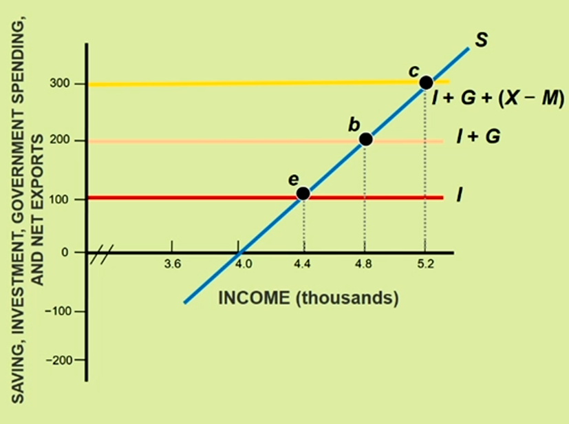

Here, I = 100, G = 100, and (X-M) = 100. 

### Recessionary Gap

This is the increase in aggregate spending required to bring a depressed economy back to full employment. This is not the total deficiency in GDP, which is the GDP gap. The multiplier times the recessionary gap equals the GDP gap. 

I, G, and X all have a multiplying effect. 

**For example**, if there was a gap of 10 billion dollars and the MPC was 0.75. The multiplier is 1/1-mpc, thus 1/0.25, which is 4. Because of this, $G(multiplier) = 10\; billion$. Thus, 10/4 = 2.5. This means the government must spend 2.5 billion in order to close a 10 billion dollar gap. 

### Inflationary Gap

The inflationary gap is the decrease in aggregate spending required to bring an overheated economy back to full employment. Inflationary pressures occur when an economy produces output above full employment. Excess spending results in higher prices, which can lead to other economic problems.

For example, suppose an economy is facing inflationary pressures because its actual GDP is $150 billion and its GDP at full employment is $140 billion. This economy has a positive GDP gap of $10 billion. If the multiplier in this economy is 4 (corresponding to an MPC of 0.75), it would need to reduce spending by $2.5 billion (which is then multiplied by 4) to bring the economy back to equilibrium. Therefore, the inflationary gap is $2.5 billion.

The reduction in aggregate spending to meet full employment = GDP gap/multiplier. Thus

**Question**: If GDP is $200 billion below the equilibrium, how much additional government spending is needed to bring the economy back to equilibrium if the MPS is 0.25? What if the MPS is 0.33? Do your answers change if the government increases taxes equal to the amount of increased spending? Explain.

**Answer**: If the MPS is 0.25, the multiplier is 4. This means that government spending would need to increase by $50 billion in order to eliminate the GDP gap of $200 billion. If the MPS is 0.33, the multiplier is 3, which means that government spending would need to be $66.7 billion to eliminate the GDP gap. If taxes are raised by an amount equal to the increased government spending, the balanced budget multiplier is equal to I, regardless of the value of MPS. Therefore, an increase in government spending of $200 billion would be needed to close the GDP gap.

## Example Problems

**If the marginal propensity to consume is 0.8 and income increases by $5,000, what is the increase in consumption?**

A. $625  
B. $1,000  
**C. $4,000**  
D. $5,000  
E. $6,250  

**Which of the following statements concerning consumption is incorrect?**

A. Wealthy people consume more than others  
B. Expectations of future prices affect consumption  
C. Tax increases reduce consumption  
**D. Saving rates decrease as income increases**  
E. Marginal propensity to consume usually decreases as income increases  

**If the multiplier is 4, government spending increases by $200, and taxes increase by $200, equilibrium income will:**

A. Decrease by $800  
B. Decrease by $200  
C. Not change  
**D. Increase by $200**  
E. Increase by $800  

**Suppose investment declines by $300. By how much will equilibrium income change if the marginal propensity to consume is 0.5?**

This is determined by multiplying the amount of reduced spending by the multiplier, which is 1/(1 − MPC), or 1/MPS.

1/0.5 = 2; 2*-300 = -600

**If the multiplier is 5 and $1,000 of new money is spent, how much will equilibrium income increase?**

This is determined by multiplying the multiplier by the amount of new money spent: 5 × $1,000 = $5000.

**How much will $200 in new spending change equilibrium income if the marginal propensity to save is 0.75?**

This is determined by multiplying the amount of new spending by the multiplier, which is 1/(1 − MPC) = 1/MPS = 1/(0.75) = 1.33; 1.33 × $200 = $266.

> The consumption function shows the relationship between consumption spending and disposable income
> The slope of the consumption function is the marginal propensity to consume

# Chapter 9

John Maynyard Keynes originated marcoeconomic theory. At that time, industrial capacity was unused, unemployment was high, and buisnesses were not investing. In that situation it was possible to expand output and unemployment by generating productive activity. 

## Aggregate Demand

The agregate demand curve shows the output of goods and services (real GDP) purchased at different price levels. 

A higher aggregate price level causes lower aggregate output. Aggregate demand slopes down due to the wealth effect, export price effect, and interest rate effect. 

**Question**: The aggregate demand curve is downward-sloping due to the effect: 
**Answer**: of prices on the competitiveness of a country's exports.

> **Wealth Effect**   As prices rise, purchasing power of wealth falls, recuding consumption.

> **Export Price Effect**   As prices rise, exports become more expensive, and exports drop. 

> **Interest Rate Effect**   As prices rise, people hold more money, pushing interest rates higher, reducing business investment. 

### Determinants of Aggregate Demand

The determinants of aggregate demand are factors that shift the entire aggrevgate demand curve, and include the following:

- Consumer Spending
- Investment
- Government Spending
- Net Exports

Note that an increase in one of the factors causes a shift to the right, whereas a decrease in one of the factors causes a shift to the left. 

When aggregate demand shifts to the right, output increases at every price level, we are able to produce more.  

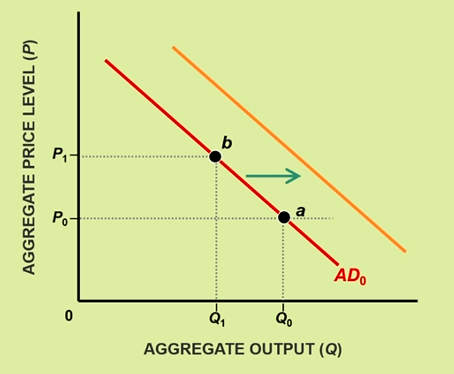

Consumer spending is affected by several major factors besides income, such as:
- Wealth
- Consumer Confidence
- Household Debt
- Interest Rates
- Taxes

Investment is determined by:
- Interest rates
- Expected Rate of Return on Investment
- Buisness Expectations

Government spending is determined by:
- Federal lawmakers
- State lawmakers
- Local lawmakers

Net Exports are determined by foreign income and exchange rates.

The aggregate supply shows the real GDP that firms will produce at various price levels. 

## Long-Run Aggregate Supply

In the long run, the aggregate supply curve is vertical. This incorporates the approac h of classical economic analysis, which assumed that all factors are variable in the long run. In the long run, the economy will automatically adjust to full employment. 

Long-Run aggregate supply is a shift in the long-run aggregate supply curve moves the economy to a new long-run equilibrium output. 

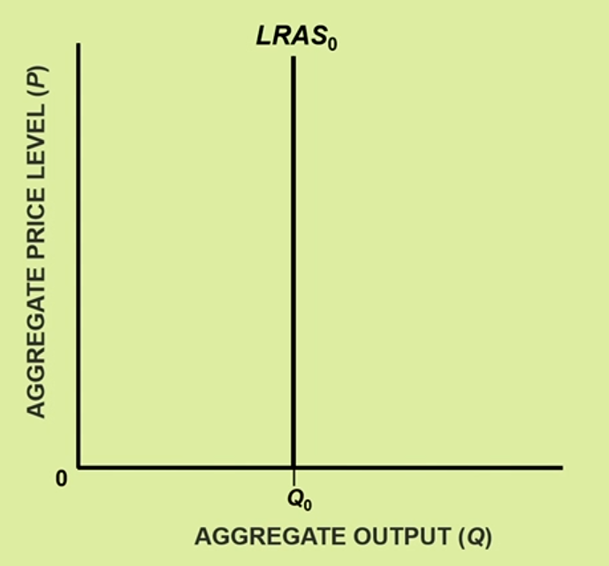

A shift in the long-run aggreegate supply curve moves the economy to a new long-run equilibrium output. 

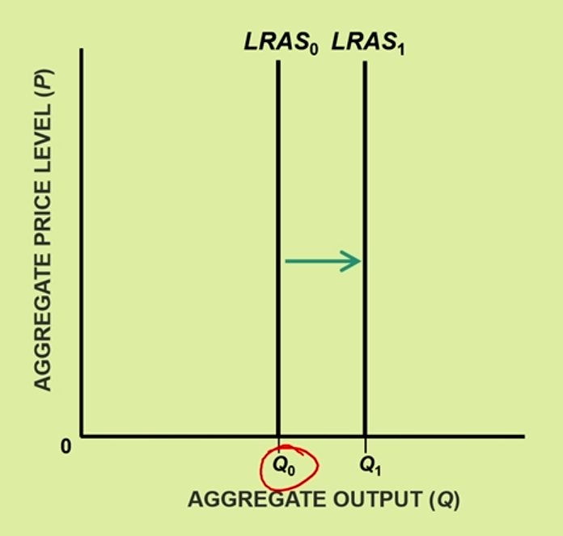

### Shifting the LRAS Curve

The LRAS Curve depends on the economy's capacity and can shift due to:
- The discovery of new resources
- Improvements in the quality of the labor force
- Technological improvements and automation
- International trade and investment

The LRAS CUrve corresponds to output at full employment and takes time to adjust. 

> The potential GDP is long-run aggregate supply. 

**Question**: In much of 2011, rising commodity prices (particularly corn, copper, and cotton) were in the news. The effect of these higher commodity prices on the economy would be illustrated by a _____ short-run aggregate supply curve.
**Answer**: shift to the left of the entire
**Explanation**: Such commodities are inputs, and higher input prices mean the entire short-run aggregate supply curve would shift to the left.

## Short-Run Aggregate Supply (SRAS)

In the short run, the aggregate supply curve is upward-sloping. Some input prices (such as wages) are slow to change. They are **sticky**. When prices rise but input prices are sticky, profit increases and firms produce more, resulting in a short-run increase in aggregate output. 

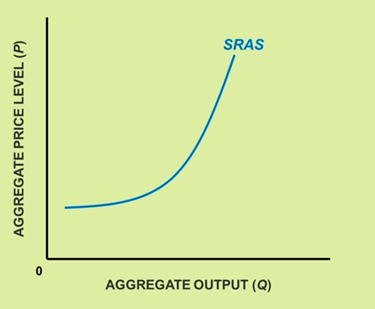

SRAS is positively sloped because input costs are slow to change. They are sticky. 

### Determinants of SRAS

The determinants of the short-run aggregate supply curve:
- Input prices
- Technology and productivity
- Taxes and regulation
- Market power of firms
- Inflationary expectations

### Shifts of the SRAS Curve

A factor that cuases the SRAS to shift to the right results in an increase in aggregate output at every price level. 

Rising input prices (such as steel), can lead to the short-run aggregate supplyu curve shifting to the left. Rising productivity increases profit and increases short-run aggregate supply. 

> Taxes and regulation add to the costs of buisness, causing the SRAS curve to shift leftward. 

As industries become more concentrated (firms have more market power), SRAS decreases. 

## Macroeconomic Equlibrium

Short-run macroeconomic equilibrium occurs where the AD and SRAS intersect. The long-run macroeconomic equilibrium occurs where the AD and LRAS intersect. 

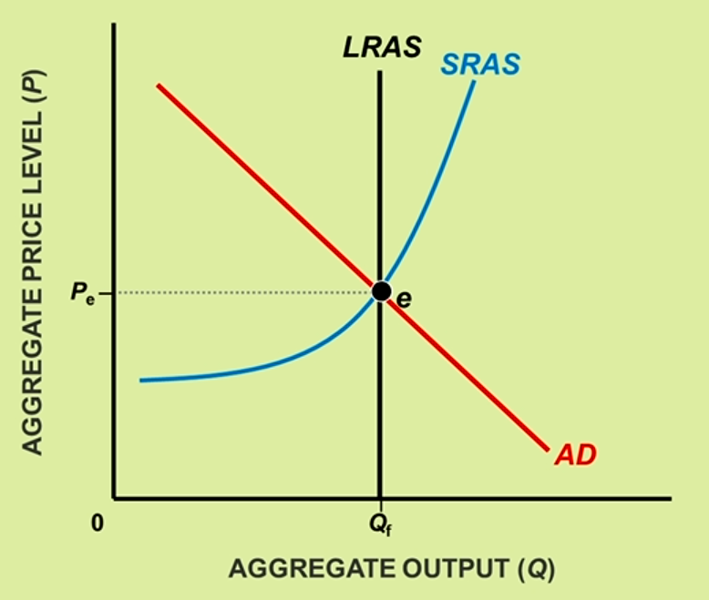

### Short-Run Equilibrium (Inflation)

Short-run equilibrium above full employment indicates an economy experiencing inflationary pressures. 

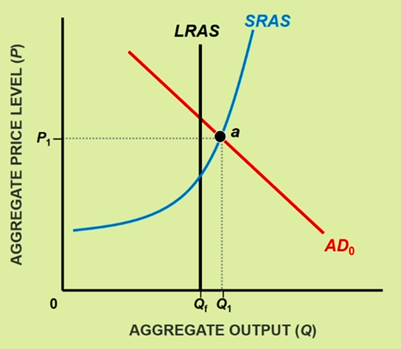

### Short-Run Equilibrium (Recession)
 
Short-run equilbrium below full employment indicates an economy experiencing a recession. 

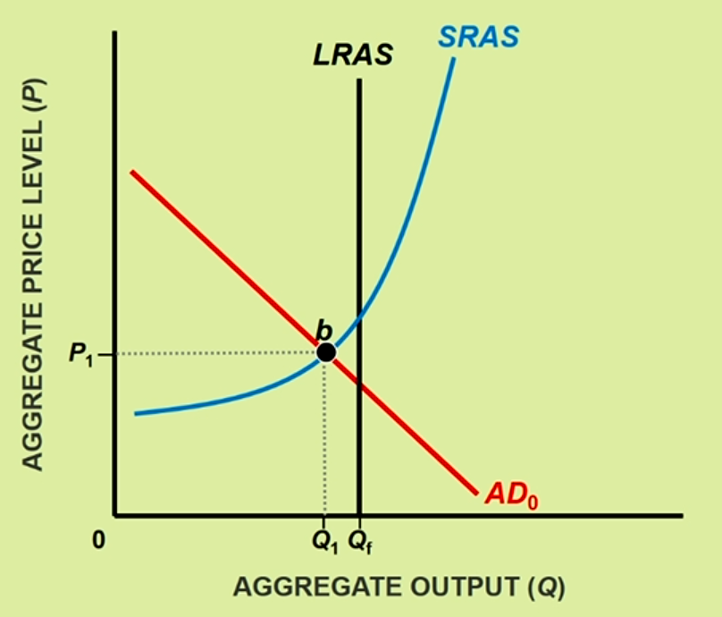

## The Multiplier and AD-AS

When short run equlibrium is below full employment, the spending multiplier magnifies new spending, shifting AD toward long-run equilibrium. 

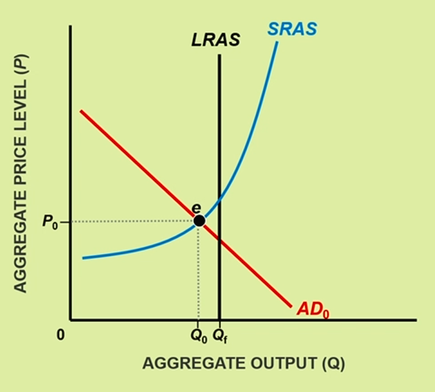 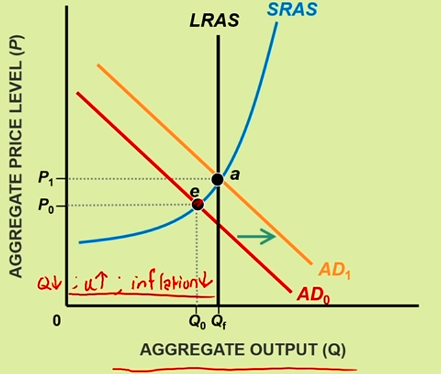

### Demand-Pull Inflation

A positive demand shock expands the economy beyond full employment output. Higher input prices shift SRAS to the left until long-run equilibrium is restored at Qf, but at a higher price level. 

In the long run, the production is the same, but the price has increased. 

The vietnam conflict increased aggregate demand and induced inflation as the economy approached full employment in 1969 in the US. 

Japan enjoyed a huge trade surplus, which expanded the economy. Interest rates were kept low, which fueled a real estate and stock market bubble, escalating the inflation rate. (1987 to 1994). 

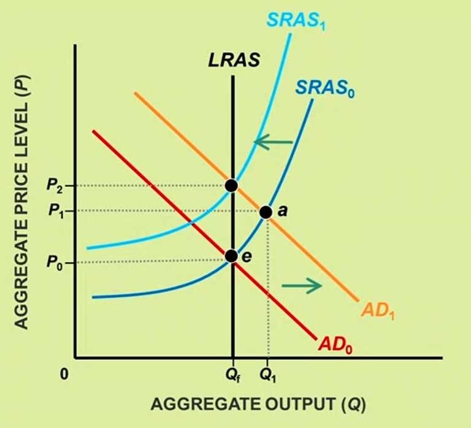

### Cost-Push Inflation

Negative supply shock reduces output and raises prices. Increasing AD will push output back to full employment but at even higher prices. Alternatively, decreasing AD will reduce inflation but increase unemployment. This is a much more difficult problem to solve. 

Stagflation: two problems at once. 

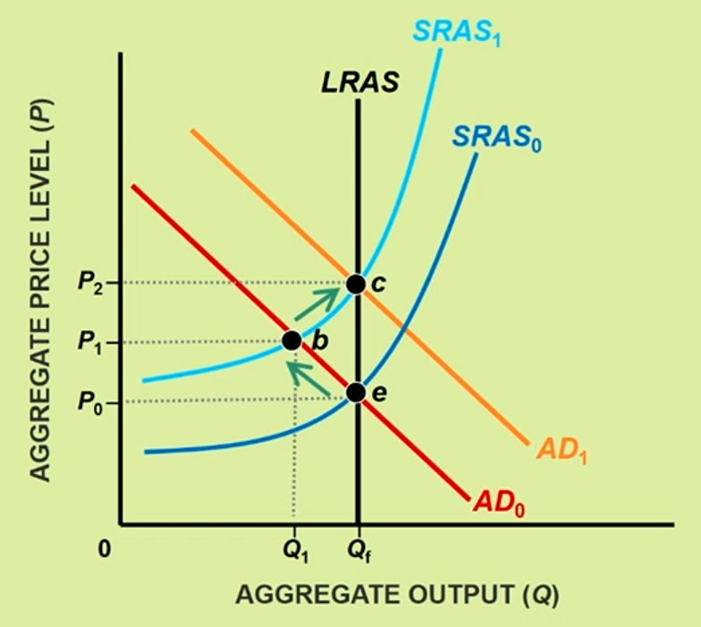

Supply chain disruptions from 2020 to 2022 led to a leftward shift of the SRAS Curve, resulting in a higher price level. 

## Questions

Which of the following does **not** occur when the aggregate price level decreases?

A. Interest Rates Decrease  
B. Purchasing Power Decreases  
**C. Value of Money Assets Decreases**  
D. Exports Increase  
E. Aggregate Output Increases  

Which of the following would shift the short-run aggregate supply curve to the right? 

A. An increase in input prices  
B. An increase in taxes  
**C. Higher interest rates**  
D. An increase in productivity  
E. Increased regulation of buisinesses  

If an economy is operating above full employment, what is likely to happen in the long run?

**Input prices and wages increase; The SRAS Curve shifts to the left**. 

## The Great Depresion, 1929-1933

During the great depression, short-run equilibrium output was far below full employment. 
- Real GDP fell by nearly 40% 
- Unemployment reached 35%
- AD shifted far to the left

A sharp increase in government spending on World War II increased aggregate demand back to long-run equilibrium. 

# Chapter 10

## Fiscal Policy

This is the use of government revenue (mainly tax recipts) and spending to influence the economy.

Each year since 2001, the federal government has spent far more than it collected in revenues, producing a deficit. This deficit adds to the national debt. 

### Federal Government Budget

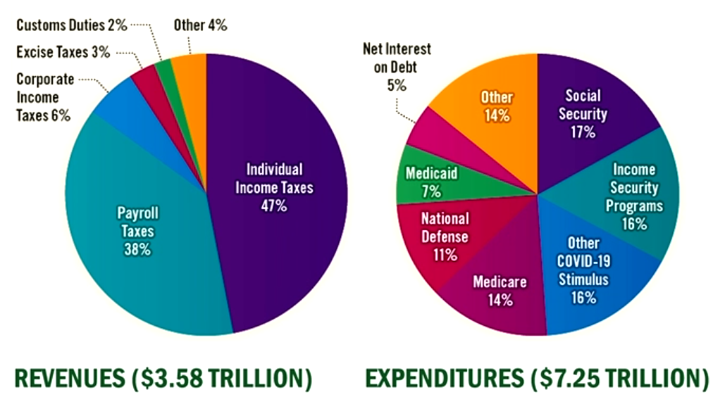

### Two Types of Federal Spending

> **Discretionary Spending**   Spending that works through the approrpiations process in congress each year. Discretionary is easy to change. Discretionary spending includes national defense, transportation, science, education, and environmental protection. 

> **Mandatory Spending**   Spending that is required by law. To adjust spending, congress must change the law. You have to jump through alot to change this. Mandatory spending includes social security, medicare, and interest on the national debt. 

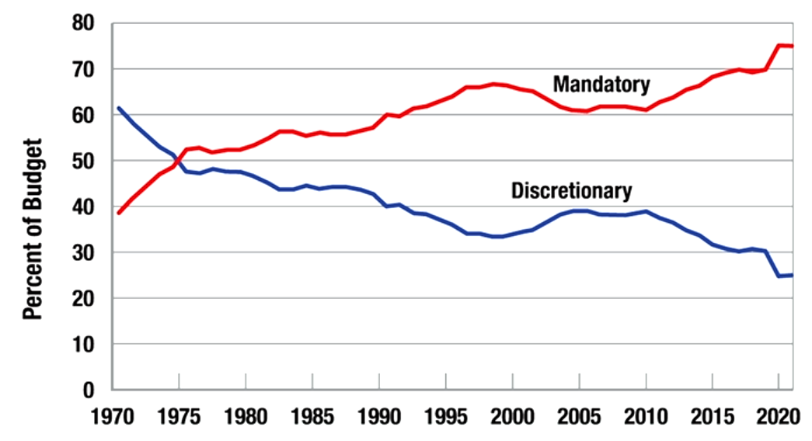

## The Multiplier and Spending

When an economy is below full employment, fiscal policy spending is magnified by the multiplier, shifting AD toward long-run equilibrium. 

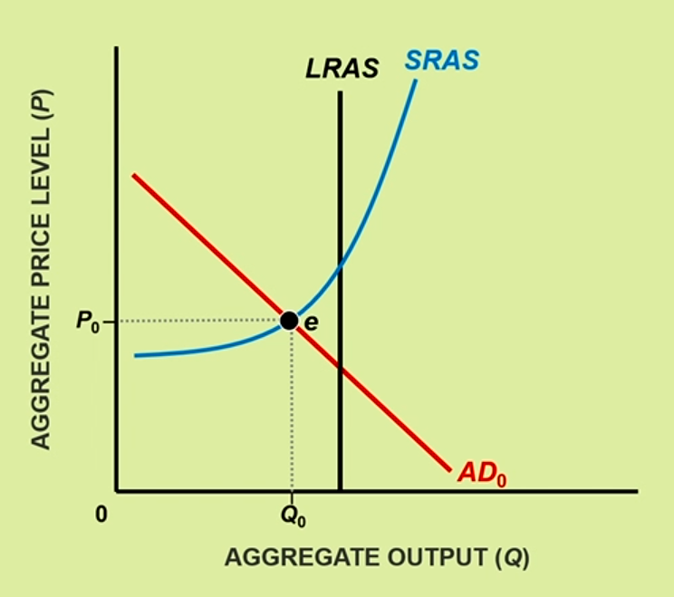

### Injections and Withdrawls

> **Spending Injections**   Injections include investment (I), governmnet spending (G), and exports (X). 

> **Spending Withdrawls**   Withdrawls include savings (S), taxes (T), and imports (M). 

In a macroeconomic equilibrium:

$$I + G + X = S + T + M$$

### Tax Changes vs. Spending Changes

An increase in taxes is paid in part by a reduction in saving, already a withdrawl from the economy. For example, a 100 increase in taxes (with MPC = 0.75) results in:

- 75 dollar reduction in consumption
- 25 dollar reduction in savings
- 100 dollar reduction in government spending would have a larger impact on aggregate output

Note, increasing taxes and decreasing government spending **slows down the economy**. 

## Two Types of Fiscal Policy

> **Expansionary Fiscal Policy**   Increasing government spending OR decreasing taxes to increase aggregate demand and output. 

Expansionary fiscal policy is effective when an economy is below long-run equilibrium. But once long-run output is achieved, expansionary fiscal policy leads to demand-pull inflation. If you are already at Qf, you should not use expansionary fiscal policy, as this would cause inflation for no reason. 

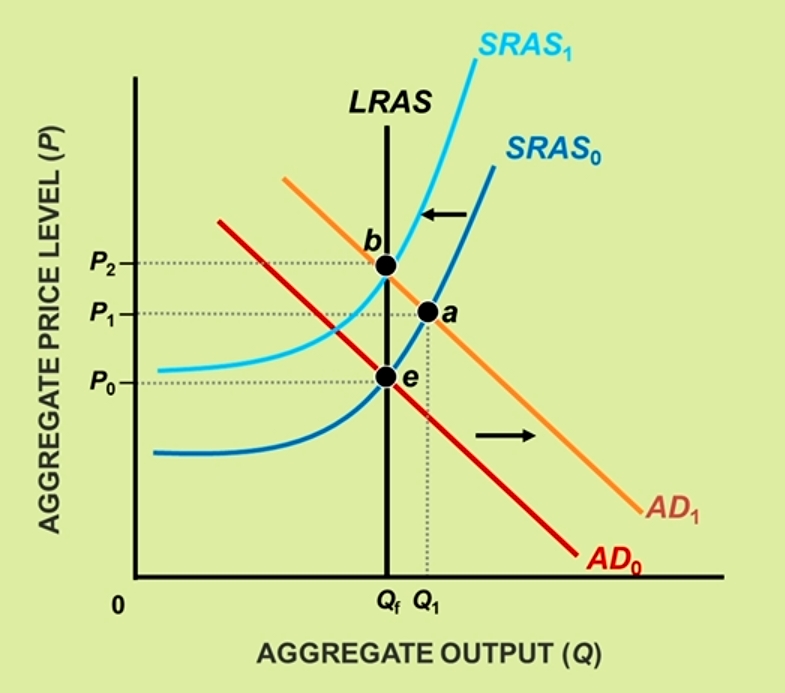

> **Contractionary Fiscal Policy**   Decreasing governmnet spending OR increasing taxes to **reduce inflationary pressures**. 

When an economy is above its full employment output level, contractionary fiscal policy can be used to shift AD back to its long-run output level, reducing inflationary pressures. 

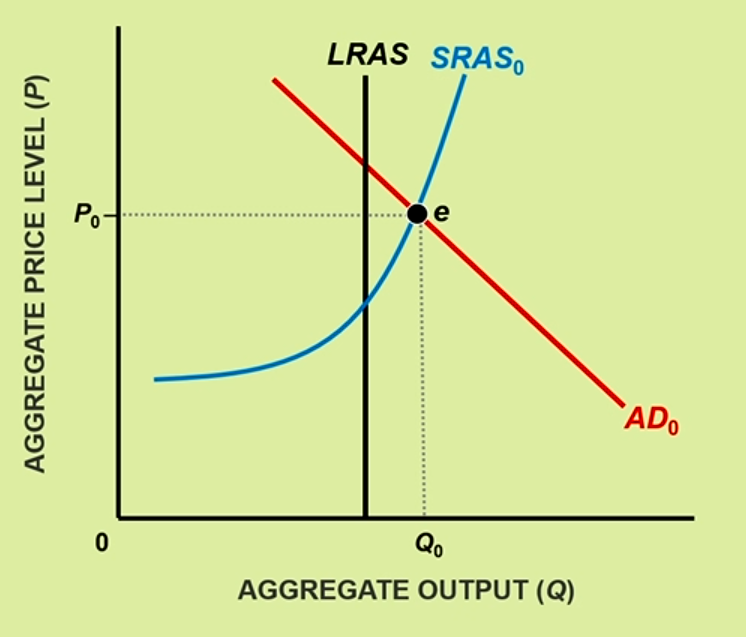

### Fiscal Policy and Aggregate Supply

The goal of supply-side fiscal policy is to expand the economy without increasing inflationary pressures. Fiscal policy is designed to shift the long-run aggregate supply curve to the right. These policies do not always require a tradeoff between price levels and output. They require more time to work than demand-side policies. 

If successful, fiscal policty directed at increasing aggregate supply can lead to more employment and lower prices. 

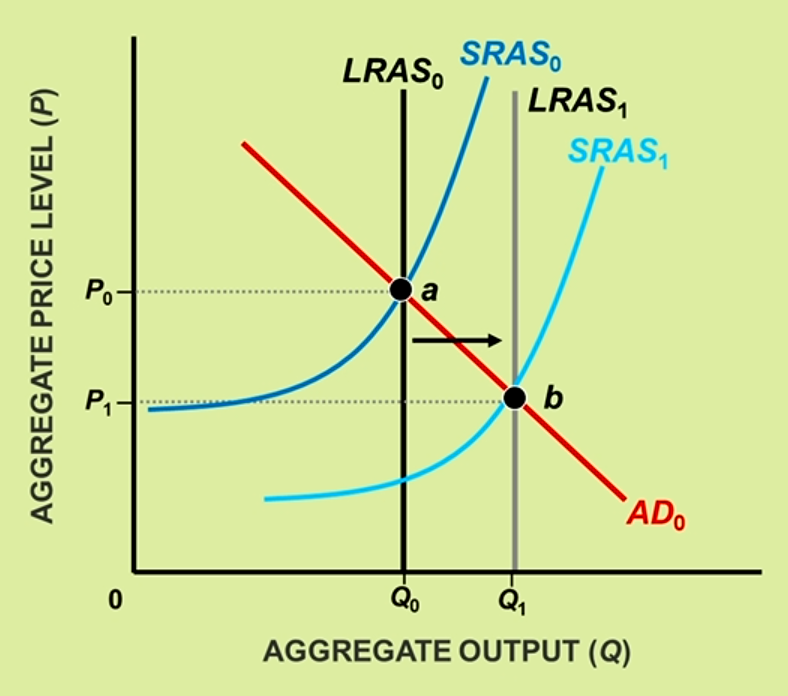

### Supply-Side Fiscal Policies

Examples of supply-side policy:

- Spending on infrastructure, education, and technology
- Reducing tax rates
- Expanding investment and reducing regulations

These factors helped to keep interst rates and inflation low for several decades. 

## The Laffer Curve

Arthur Laffer suggested that reducing tax rates could lead to increased tax revenues. Lower tax rates encourage people to work and encourage business to invest. As investment grows, incomes rise, which leads to higher tax revenues. 

What is the optimal tax rates? Is maximizing tax revenues good for the economy? 

Tax revenues rise as tax rates increase from 0% to point b, then fall as tax rates increase further. Different tax rates can lead to the same ammount of tax revenue, such as point a and point c. 

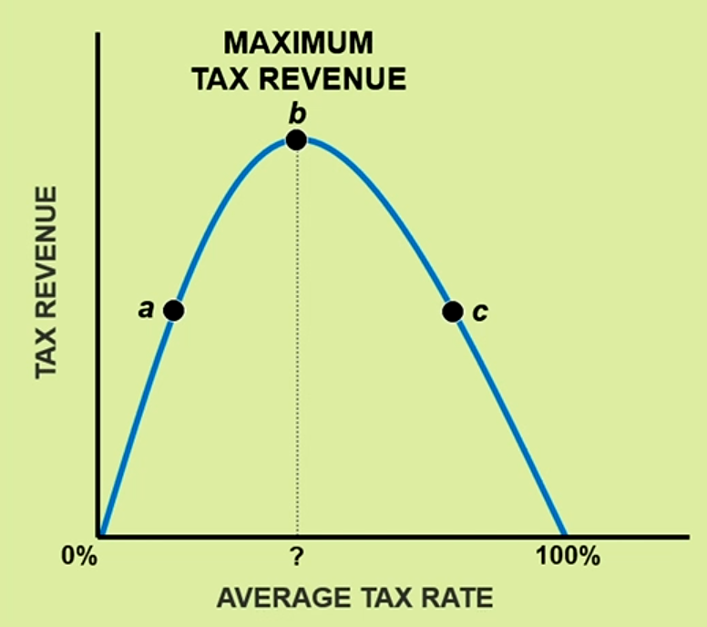

### Encouraging Investment

Investment can be increased by 
- Investment tax credits
- More rapid depreciation schedules for plant and equipment. Allowing firms to expense capital in a shorter period reduces the tax burden
- Repealing unnessecary regulation
- Governmnet grants for research

### Automatic Stabilizers

Tax revenues and transfer payments automatically adjust to economic fluctuations without action by congress. When the economy is growing, tax revenues increase (from higher taxable income) and transfer payments fall (because fewer people require income assistance). These effects temper the increase in economic output. 

Fiscal policy takes time to work. Especially in a divided governmnet, there is a time lag for a problem to be recognized and solutions to be implemented. 

### Fiscal Policy Timing Lags

- **Information Lag**: Most data that policymakers need are not available until at least one quarter after the fact.
- **Recognition Lag**: It takes time to recognize trends in the data.
- **Decision Lag**: Policies must be debated and passed in congress andd signed by the president. This is often where it dies off. 
- **Implementation Lag**: Once a policy becomes law, it takes time to plan, budget, and implement the new program. 

Fiscal policy is often financed by deficits because policymakers find it difficult to **raise taxes** or reduce spending. 

### Defecits and the National Debt

- **Deficit**: Ammount by which annual government spending exceeds tax revenues
- **Surplus**: Ammount by which annual tax revenues exceed government spending
- **National Debt**: The total accumulation of past deficits less surpluses

### Approaches to Balancing the Budget

> **Annually Balanced Budget**   Revenues and spending must be equal each year. This generally makes recessions worse by forcing spending cuts during economic downturns, when tax revenues drop. 

> **Cyclically Balanced Budget**   The budget must be balanced over the buisness cyucle by increases in taxces or reductions in spending during periods of growth to offset deficits that result from recessions. 

> **Functional Finance**   Balancing the budget is not the primary concern of policymakers. The focus is on promoting economic growth and stable prices, and keeping the economy as close as possible to full employment. 

## Financing Debt and Deficits

The government budget constraint

$$G-T=\Delta M + \Delta B + \Delta A$$

- (G) Government Spending
- (T) Tax Revenues (G - T is the deficit)
- (DM) = Change in money supply (selling bonds to the federal reserve)
- (DB) = Change in bonds held by the public
- (DA) = The sale of government assets

Is the size of the national debt a problem? Only if the cost of financing the debt places an excessive burden on the budget. 

Low U.S. treasury rates over the past two decades allowed interest payments on the national debt to be less than 2% of the GDP. However, large deficits and higher interest rates in recent years will increase the economic burden of the debt. 

A large portion of the national debt is owed to american holding treasury bonds. Therefore, interest payments on this portion go to other americans. 

### Equity Aspects of the National Debt

A concern regarding the national debt is the effect on the **wealth distribution**. People who own part of the national debt tend to be wealthier than those who do not. Interest payments on the debt therefore redistribute wealth to the rich, leading to **greater income inequality**. 

### Internal vs. External Debt

About one-third of all debt held by the public is held by foreigners (external debt). Interest payments to foreigners are a real claim on U.S. output. 

### Crowding-Out Effect

Another concern is that the government finances its debt by selling bonds, pushing the **interest rate higher**. Higher interest rates make consumers and businesses less likely to borrow purchases and investment. Therefore, **government debt crowds out consumption and investment**, leading to a less productive future economy. 

Fiscal sustainability occurs when the present value of all projected future revenues equals the present value of projected future spending. 

**Question**: Which of the following is **not** a way the government can finance its deficit. 

A. Selling assets owned by the government
B. Selling bonds to foreign governments
C. Increasing the money supply by printing money
D. Selling bonds to domestic citizens
**E. Buying bonds from the federal reserve**

This should be selling bonds **to** the federal reserve. 

# Exam Review

**Question**: If the MPC = 0.75 and income rises by $2,000, by how much will consumption increase?  
**Answer**: MPC means Marginal Propensity to Consume, therefore 75% of new income will be spent. Thus, 0.75 * 2,000 = **1,500**.

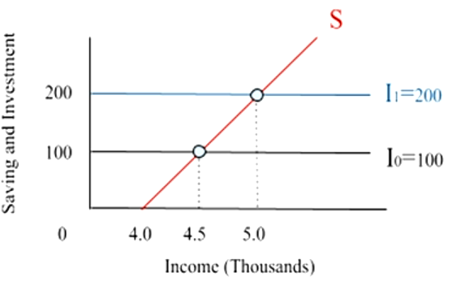

**Question**: The panel above shows that a $100 increase in investment leads to a $500 rise in income. Calculate the multiplier and the marginalpropensity to consume.  
**Answer**: If investment is equal to savings, a $100 increase in investment means a $100 increase in savings. Thus, the Marginal Propensity to Save (MPS) is 0.2, and 1-0.2 is 0.8, which is the Marginal Propensity to Consume (MPC). Thus, 1/1-0.8 is 5, which means the answer is **5; 0.80**. 

**Question**: Which of the following is **not** considered an injection in the full aggregate expenditures model?
**Answer**: Savings. This is because AE = C + I + G + (X - M)

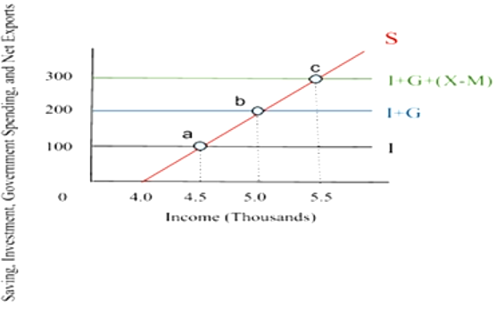

**Question**: Analyze the panel above. Assume exports equal $800. What is the value of imports?  
**Answer**: 700

**Question**: Suppose an economy is facing a negative GDP gap of $10 billion. If the MPC = 0.75, by how much will spending need to change to close this gap? Should this be an increase in spending or a decrease?  
**Answer**: 2.5 billion; increase. 1/1-0.75 = 4; 1/4 * 10B = 2.5B. 

**Question**: According to the full aggregate expenditures model, if investment is $2.S trillion, government spending is $4.S trillion, taxes are $3 trillion, and net exports are $0, what is savings equal to?  
**Answer**: 4 trillion; G+I+X=S+T+M; 4.5+2.5=3+X; X=7-3; X=4

**Question**: Which of the following would explain the rightward shift in the aggregate demand curve?  
**Answer**: Lower interest rates

**Question**: Which of the following events is most likely to cause a movement along the aggregate demand curve?  
**Answer**: A fall in the real value of money in the economy due to a higher aggregate price level

**Question**: If the price level decreases in the United States relative to other countries, then the United States will export _______ goods and services; and will import _______ goods and services.  
**Answer**: more; fewer

**Question**: Which of the following would explain the leftward shift in the short-run aggregate supply curve?  
**Answer**: A rise in input prices

**Question**: 12. When analyzing the LRAS (illustrated in panel to the right), we can assume that product prices, wages, and interest rates are _______.  
**Answer**: flexible

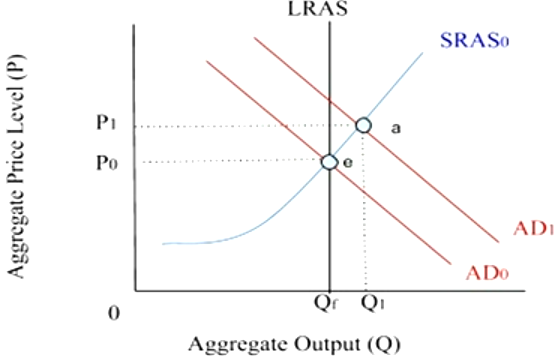

**Question**: Assume that the economy is in long-run equilibrium at point e. Is the short-run equilibrium output at point a above or below full employment output? Which type of inflation does the panel above illustrate?  
**Answer**: above; demand-pull inflation

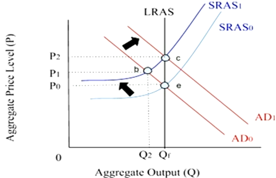

**Question**: The panel above shows a cost-push inflation scenario. What policy could the government implement that would result in the rightward shift in the demand curve?  
**Answer**: Increase government spending

**Question**: Suppose the government implements tax cuts to encourage people to spend their tax savings and businesses to invest. This is an example of a(n)  
**Answer**: expansionary fiscal policy

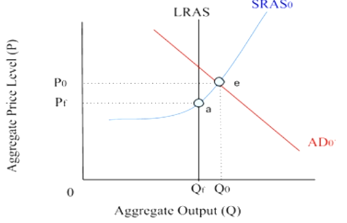

**Question**: Examine the graph above. Assume point e is the starting point. Which policy should the government pursue to bring the economy to its full employment level?  
**Answer**: contractionary fiscal policy

**Question**: Supply-side fiscal policies focus on shifting the long-run aggregate supply curve to the right, resulting in a rice level and unemployment.  
**Answer**: lower; lower

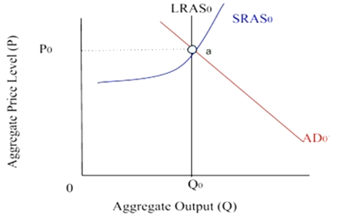

**Question**: Suppose this panel is for the world economy. Assume that free trade has been kept to a minimum. If the world economy decides to embrace trade, what will happen to the aggregate price level and aggregate output for the world economy?  
**Answer**: price decreases; output increases

**Question**: La La Land's public debt is currently $20 billion, of which $6 billion is owed to domestic bondholders, $6 billion to domestic banks, and $8 billion to foreign governments. What is the percentage of La La Land's external debt?  
**Answer**: 40%

**Question**:   
**Answer**: 

**Question**:   
**Answer**: 

**Question**:   
**Answer**: 

LEFT = COST PUSH; RIGHT = DEMAND PULL